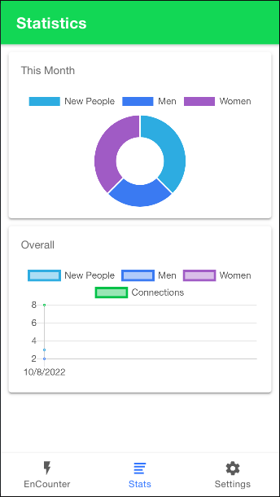
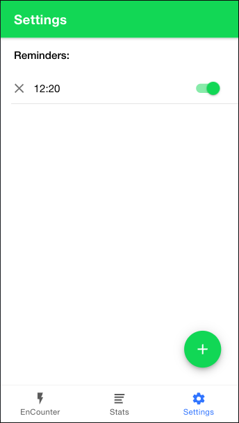

<h1 style="text-align: center;">Encounter</h1>

Count your encouters - New People you met during the day
Review your stats, how you did yesterday, last month or last year
Set reminders in the form of notifications

  
  
  
  

If you are trying to run this app locally, you need a lower version of Node.js like v14 since most of the dependecies in the project are outdated.

