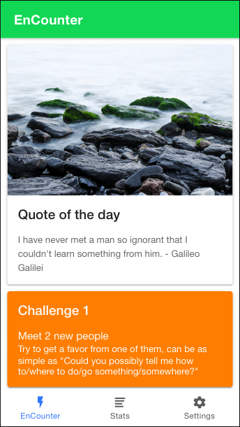
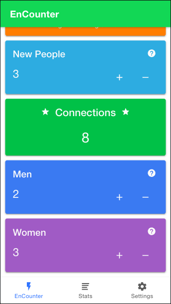

# Encounter

Count your encouters - New People you met during the day
Review your stats, how you did yesterday, last month or last year
Set reminders in the form of notifications

  
  
  
  

To run locally:
### `npm i && npm start`

